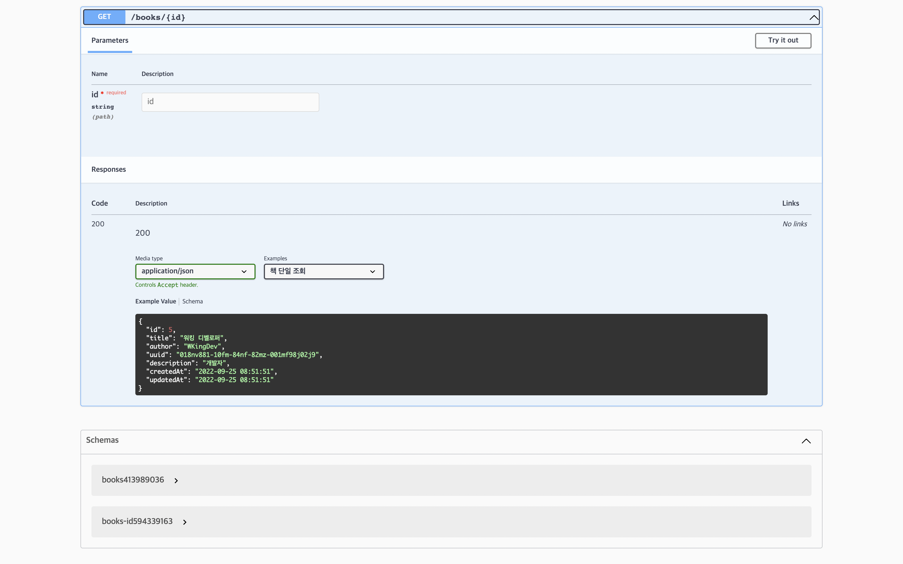

### Spring-OAS-Docs

---
[KOR]

간단한 book 조회 RestAPI 명세서를 만들어봅니다.

restdocs-api-spec를 사용하여 통합 테스트를 진행합니다.
테스트 성공 결과로 OpenAPI Specification(OAS) 파일 형식의 openapi3.yaml 파일을 얻어냅니다.  
해당 파일을 Redoc, Swagger-UI에 적용하여 API 명세서를 보여줍니다.

[ENG]

Let's create a simple book lookup RestAPI specification.

I use restdocs-api-spec to run restassured tests.
As a result of a successful test, an openapi3.yaml file in the OpenAPI Specification (OAS) file format is obtained.
Apply the file to Redoc, Swagger-UI to show the API specification.

---
## Run
[KOR]
1. SpringOasDocsApplication 실행
2. Gradle Task 실행 
   1. 실행 순서 : opeanapi3 -> copyOasToDocs
3. http://localhost:8080/docs/redoc.html & http://localhost:8080/docs/swagger-ui.html 접속 

[ENG]
1. Run SpringOasDocsApplication
2. Run Gradle Task
    1. Execution order: opeanapi3 -> copyOasToDocs
3. Access http://localhost:8080/docs/redoc.html & http://localhost:8080/docs/swagger-ui.html

---
## Results screen
### Redoc

### Swagger

